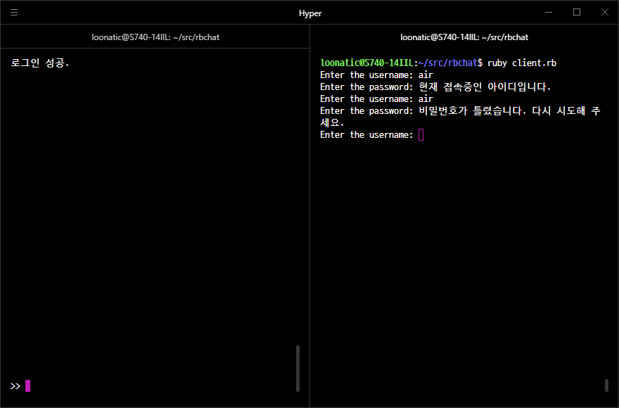
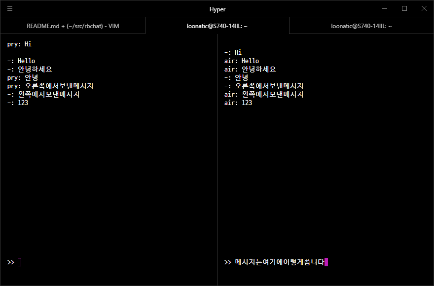
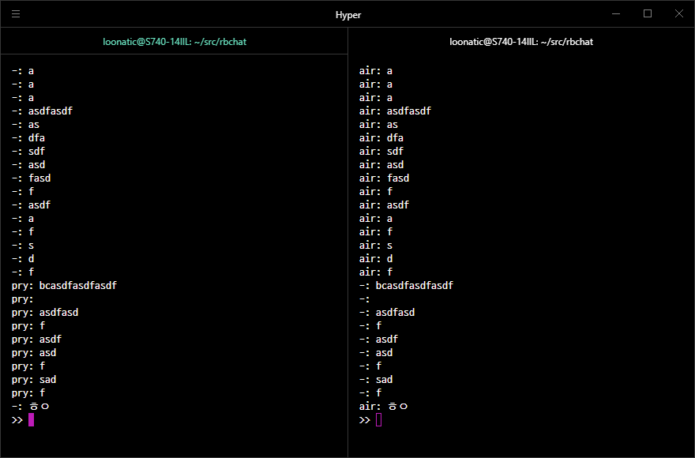

# 
 2020년 1학기 클라우드컴퓨팅 Term Project 

## 설계 목표

- 채팅 프로그램 만들기

## 현실적 제한조건

- GUI로 만들지 않고 CLI로만 동작하게 한다.
- 비밀번호는 암호화해서 전송을 할까 생각을 하긴 했지만, 이 프로젝트에서는 굳이 그럴 필요성을 못느꼈기 때문에 어려운건 아니지만 테스트시 편리함을 위해서 그냥 평문으로 전송한다.
- 테스트를 혼자 해야 하기 때문에, 노트북 하나에서 터미널을 여러개 켜서 테스트를 해본다.

## 세부목표

- 로그인 관리는 Key-Value Store (Redis)를 사용한다.
- 접속중인 아이디는 다른 클라이언트에서 동시 접속이 불가능하게 한다.
- 실시간으로 채팅이 되게 해주고, 로그인 했을때만 메시지를 볼 수 있다. (접속 중이 아닐 때, 다른 유저들이 채팅한 내용은 볼 수 없음.)

## 세부목표에 해당하는 도출된 아이디어

- 계획서 작성시에는 ID와 비밀번호, 세션값을 저장해서 중복 로그인 체크를 하려고 함.
  - 로그인 할 때, 서버에서 현재 접속중인 클라이언트들의 정보를 가지고 있기 때문에 따로 세션을 만들어서 저장하지 않아도 중복 로그인을 차단할 수 있음.
  - 프로그램 안에서 반복문을 통해서 접속중인지 보는 것 보다, Redis의 bit라는 데이터 타입을 사용하는게 효율적인 것 같아서 사용을 함.
    - bit_login과 bit_index라는 bit 데이터를 만듦.
    - bit_index의 bitcount값은 현재 가입된 아이디 수이기 때문에, 새로운 아이디가 생성될때의 인덱스값은 bitcount bit_index로 설정하고 setbit bit_index #{인덱스} 1을 해줌.
    - 로그인 시에는 setbit bit_login #{인덱스} 1을 하고, 로그아웃시 setbit bit_login #{인덱스} 0을 함.
    - 로그인 시 getbit bit_login #{인덱스}를 해서 1이 나오면, 현재 접속중인 아이디 이므로 로그인이 안되게 함.
- 계정 생성은 로그인 시에 없는 ID를 입력하면 그 입력한 ID와 비밀번호로 새 계정을 만드는 방식으로 함.

## 아이디어 실현을 위한 학습내용

- Redis 사용법을 익힘.
- 서버와 클라이언트간 소켓 통신을 할 때 데이터를 주고받을 때 사용하기 위해서 루비의 JSON 라이브러리 사용법을 익힘.
- tty-cursor와 tty-screen 라이브러리 사용법을 익힘.

## 설계과정에서의 시행착오 과정

- {ID, (PWD, Session)} 식으로 저장을 해서 중복 로그인을 구현하려고 했는데, 구현이 어려운건 아니지만 그렇게 구현할시 너무 비효율적으로 동작함
  - {ID, (PWD, Idx)}를 저장을 하고 bit_login과 bit_index라는 비트 데이터형을 만들어서 중복로그인을 관리함.
- 상대방이 보낸 메시지가 위에서부터 쌓이고, 내가 보내려는 메시지도 위에서 입력을 해서 입력하던중에 메시지가 오거나 하면 글씨가 이상하게 겹쳐져서 나옴.
  - tty-cursor라는 라이브러리를 사용해서 메시지는 위에서부터 쌓이도록 만들고, 보낼 메시지는 맨 아랫줄에서 입력.
    - 프로그램 실행 시 터미널의 커서를 맨 밑줄로 옮기고 >> 라고 출력을 해서 메시지를 입력하게 만든다.
    - 다른 유저에게서 메시지가 도착하면 커서를 위로 옮겨서 출력을 한 후 다시 원래대로 되돌린다.
    - 메시지가 화면 전체를 덮으면 입력 창과 겹쳐서 이상하게 보이는 현상이 있어서, 메시지를 화면 길이만큼의 버퍼에 저장하고 버퍼에 있는 내용들을 화면 맨 위에서부터 다시 출력하는 방법으로 해결한다.

## 설계결과물

- 서버 프로그램은 클라이언트끼리 채팅하는 것을 도와주는 역할만 하고, 클라이언트에서 접속 요청시 생성된 소켓 객체를 출력하는것 외에는 별도의 출력이 없으므로 사진을 따로 첨부하지 않습니다.

- 테스트시에는 ID: air, PWD: air라는 계정과 ID: pry, PWD: pry 라는 계정으로 테스트하였습니다.

- 왼쪽에서 air라는 계정으로 로그인을 한 상태에서는 아이디와 비밀번호를 맞게 쳐도 같은 계정으로 로그인이 되지 않습니다.
- 두번째 입력은 ID에 air라는 값을 넣고 비밀번호는 123 이라고 쳤을 때인데 이렇게 비밀번호를 잘못 입력한 경우에는 현재 접속중인지 여부를 알려주지 않고 비밀번호가 틀렸다는 메시지만 보여줍니다.

- 채팅이 순서대로 위에서부터 쌓이고, 메시지 입력은 화면 맨 밑쪽에서 됩니다.

- 채팅이 많이 쌓여도 버퍼에 저장해서 다시 출력을 하기 때문에 문제없이 잘 출력이 됩니다.

## 결과물의 성과:

실질적으로 이런 실시간 채팅 기능 하나만 있는 프로그램을 쓸 이유는 없겠지만, Key-Value Store의 일종인 Redis를 다루는 방법과, 동시 접속을 체크할 수 있는 방법, 터미널의 커서를 조종하는 방법 등을 익힌 좋은 경험이었다고 생각합니다.
